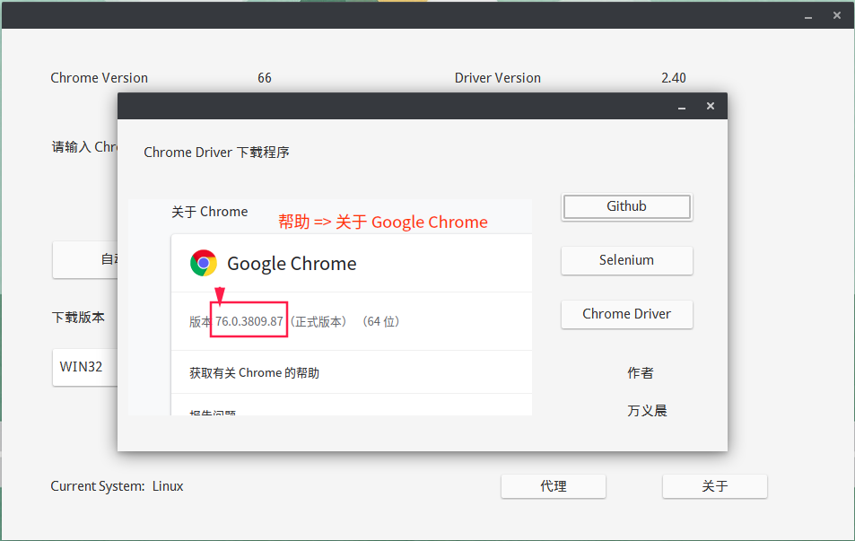
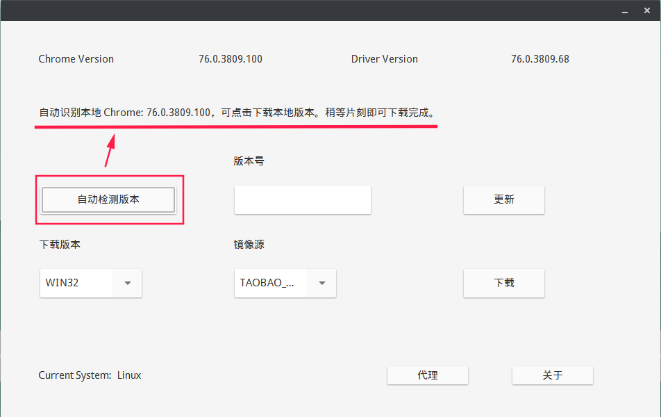
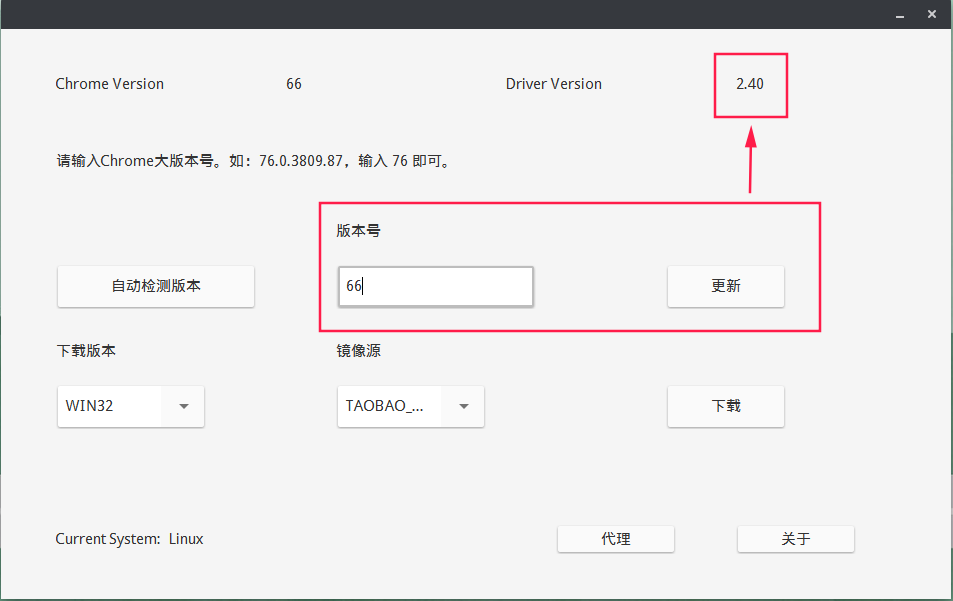
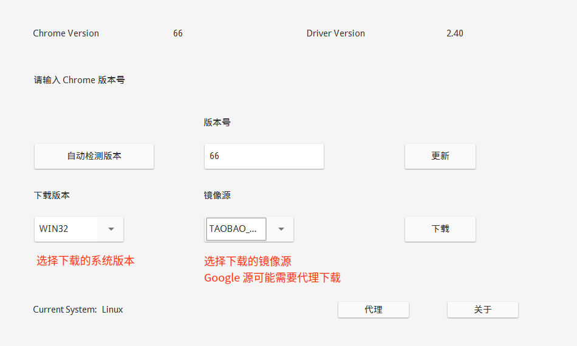
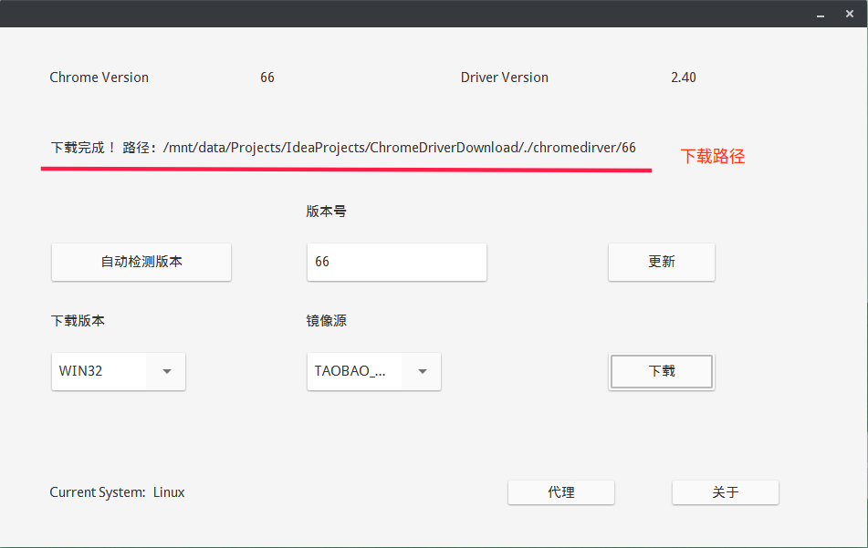
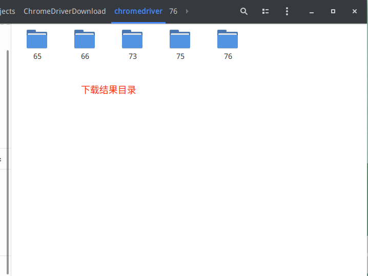
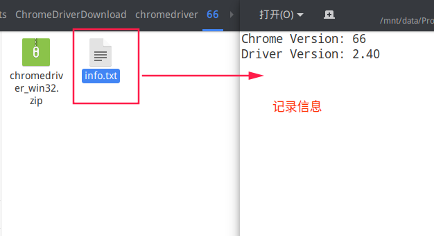

# ChromeDriver 下载程序

本程序可自动识别本地安装的 Chrome 浏览器版本（Ubuntu18.04，Windows10 上测试通过，其他未测试），找到相应的 ChromeDriver 驱动版本，进行下载。
也可输入需要下载的 Chrome 版本与系统信息，下载对应的版本的 ChromeDriver。

## 介绍



```shell
java -jar ./ChromeDriverDownload.jar
```

#### 自动检测本地安装的信息

识别本地安装的 Chrome 版本（Ubuntu18.04，Windows10 上测试通过，其他未测试）




#### 无法识别信息，可进行手动输入

手动输入 Chrome 版本仅需要输入相应的大版本号即可



#### 选择需要的系统版本，下载的镜像源后点击下载即可

Google 下载源可能需要代理使用。**本程序代理待开发**。如需使用，请打开全局系统代理。

- [Taobao源](https://npm.taobao.org/mirrors/chromedriver/)
- [Huawei源](https://chromedriver.storage.googleapis.com/)
- [Google源](https://mirrors.huaweicloud.com/chromedriver/)



#### 点击下载后稍等片刻即可下载完成





## 其他

- [ChromeDriver官网](https://sites.google.com/a/chromium.org/chromedriver/)
- [Selenium官网](http://docs.seleniumhq.org/)
- [Chromium](https://www.chromium.org/)
